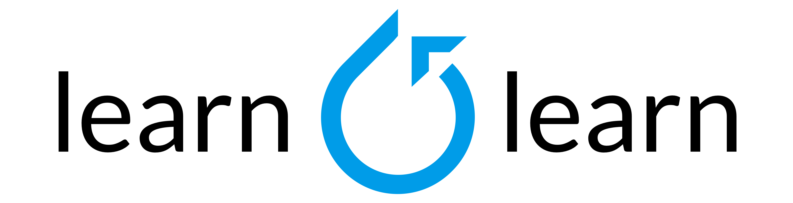

--------------------------------------------------------------------------------

learn2learn is a PyTorch library for meta-learning implementations.
It was developed during the [first PyTorch Hackathon](http://pytorchmpk.devpost.com/). Edit: L2L was lucky to win the hackathon!

**Note** learn2learn is under active development and many things are breaking.

# Installation

~~~bash
pip install learn2learn
~~~

# API Demo

~~~python
import learn2learn as l2l

mnist = torchvision.datasets.MNIST(root="/tmp/mnist", train=True)

task_generator = l2l.data.TaskGenerator(mnist, ways=3)
model = Net()
maml = l2l.MAML(model, lr=1e-3, first_order=False)
opt = optim.Adam(maml.parameters(), lr=4e-3)

for iteration in range(num_iterations):
    learner = maml.new()  # Creates a clone of model
    task = task_generator.sample(shots=1)

    # Fast adapt
    for step in range(adaptation_steps):
        error = compute_loss(task)
        learner.adapt(error)

    # Compute validation loss
    valid_task = task_generator.sample(shots=1, classes_to_sample=task.sampled_classes)
    valid_error = compute_loss(valid_task)

    # Take the meta-learning step
    opt.zero_grad()
    valid_error.backward()
    opt.step()
~~~

# Changelog

The following changelog is mostly for the hackathon period.

## August 12, 2019

* Basic implementation of MAML, FOMAML, Meta-SGD.
* TaskGenerator code for classification tasks.
* Environments for RL.
* Small scale examples of MAML-A2C and MAML-PPO.

# Acknowledgements

1. The RL environments are copied from: https://github.com/tristandeleu/pytorch-maml-rl
